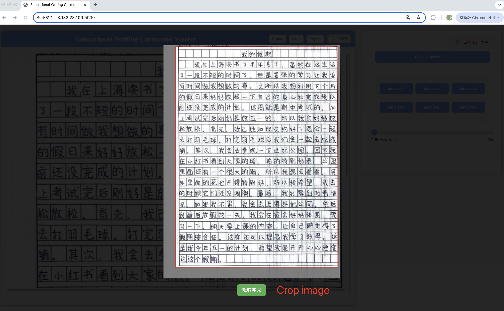

# EduWCS: An Interactive Educational Writing Correction System for Learning Chinese as a Foreign Language

EduWCS is an innovative interactive educational writing correction system designed to address the core challenges faced by learners of Chinese as a Foreign Language (CFL).

## 📖 The Significance in Edutech

For learners of Chinese, mastering writing is a dual challenge of grasping complex logographic characters and intricate grammar. Traditional pedagogy often involves handwritten assignments, which are time-consuming for teachers to grade. Meanwhile, existing digital Grammatical Error Correction (GEC) tools are predominantly text-based, failing to accommodate the common and effective practice of handwriting.

**EduWCS aims to bridge this gap, acting as a link between traditional pedagogical practices and cutting-edge technology.**

## ✨ Key Features
We are more than just a grammar checker; we are a **learning assistant built on a pedagogical foundation**. The value of EduWCS lies in:

*   **✍️ Supporting Real-World Practice**: By processing images of handwritten essays directly, our system aligns with students' actual learning habits and classroom scenarios.
*   **🎨 Providing Pedagogical Feedback**: The system doesn't just offer a single "correct" version. Our innovative adjustable feedback mechanism allows learners to choose their desired level of correction—from fixing only critical errors to comprehensive polishing. This avoids the "over-correction" issue, which can be discouraging, and facilitates a smoother learning curve.
*   **🚀 Intuitive Visual Feedback**: Corrections are visually overlaid directly onto the original handwritten manuscript. This helps learners intuitively understand the source of their errors, reinforcing memory and promoting deeper learning.

## 📸 System Interface
The system workflow is simple and intuitive. Users upload an image of their handwritten work, and the system automatically handles recognition, correction, and visual annotation.

### Detailed Workflow
1. **Image Pre-processing**: Use the built-in **Rotate** and **Crop** tools to easily adjust your image before correction, ensuring optimal recognition accuracy.

2.  **Upload Image**: Click the button to upload a photo of your handwritten essay.

3.  **Activate Correction**: Toggle the correction switch "on" to begin processing.

4.  **Review Interactively**:
    *   In the right-hand panel, review the categorized list of detected edits (e.g., Insertion, Deletion, Substitution).
    *   Drag the **"Edit Progress"** slider to dynamically adjust the number of corrections applied. Slide left for minimal edits; slide right for a full revision.

4.  **Locate Errors**: In the main preview area, corrections are overlaid directly onto your handwriting using highlights and strikethroughs.

5.  **Export & Save**: Export the final annotated image for future reference.

## 🧪 Experiment Results
<table>
  <thead>
    <tr>
      <th>Recog.</th>
      <th>Correct.</th>
      <th colspan="3">Detection Character-Level</th>
      <th colspan="3">Correction Character-Level</th>
      <th colspan="3">Detection Sentence-Level</th>
      <th colspan="3">Correction Sentence-Level</th>
    </tr>
    <tr>
      <th></th>
      <th></th>
      <th>Prec.</th><th>Rec.</th><th>F0.5</th>
      <th>Prec.</th><th>Rec.</th><th>F0.5</th>
      <th>Prec.</th><th>Rec.</th><th>F0.5</th>
      <th>Prec.</th><th>Rec.</th><th>F0.5</th>
    </tr>
  </thead>
  <tbody>
    <tr><td colspan="14" style="text-align:center;"><b>Two-stage Pipeline</b></td></tr>
    <tr>
      <td rowspan="4">OCR</td>
      <td>GECToR</td>
      <td>45.64</td><td>38.31</td><td>43.96</td>
      <td>10.23</td><td>6.80</td><td>9.29</td>
      <td>15.65</td><td>19.17</td><td>16.24</td>
      <td>4.47</td><td>4.47</td><td>4.47</td>
    </tr>
    <tr>
      <td>SynGEC</td>
      <td>66.98</td><td>69.15</td><td>67.41</td>
      <td>21.98</td><td>26.32</td><td>22.73</td>
      <td>28.92</td><td>58.42</td><td>32.17</td>
      <td>11.38</td><td>11.38</td><td>11.38</td>
    </tr>
    <tr>
      <td>Qwen2-7b</td>
      <td>57.85</td><td>39.43</td><td>52.91</td>
      <td>30.43</td><td>23.03</td><td>28.59</td>
      <td><b>32.95</b></td><td>45.31</td><td><b>34.85</b></td>
      <td><b>15.85</b></td><td><b>15.85</b></td><td><b>15.85</b></td>
    </tr>
    <tr>
      <td>Qwen2.5-7b</td>
      <td>57.30</td><td>43.60</td><td>53.91</td>
      <td>30.90</td><td>24.07</td><td>29.24</td>
      <td><b>31.55</b></td><td>50.00</td><td><b>34.06</b></td>
      <td>15.45</td><td>15.45</td><td>15.45</td>
    </tr>
 <!-- CLIP Multirow -->
    <tr>
      <td rowspan="3">CLIP</td>
      <td>GECToR</td>
      <td>69.92</td><td>62.42</td><td>68.28</td>
      <td>26.63</td><td>22.40</td><td>25.66</td>
      <td>10.92</td><td>20.88</td><td>12.07</td>
      <td>3.66</td><td>3.66</td><td>3.66</td>
    </tr>
    <tr>
      <td>SynGEC</td>
      <td><b>77.98</b></td><td><b>81.58</b></td><td><b>78.67</b></td>
      <td>31.83</td><td><b>36.28</b></td><td><b>32.63</b></td>
      <td>23.47</td><td><b>60.98</b></td><td>26.77</td>
      <td>6.10</td><td>6.10</td><td>6.10</td>
    </tr>
    <tr>
      <td>Qwen2-7b</td>
      <td>71.49</td><td>65.25</td><td>70.15</td>
      <td><b>32.39</b></td><td>28.11</td><td>31.43</td>
      <td>21.22</td><td>36.19</td><td>23.14</td>
      <td>6.10</td><td>6.10</td><td>6.10</td>
    </tr>
    <tr><td colspan="14" style="text-align:center;"><b>End-to-end multi-modal LLMs</b></td></tr> <tr>
      <td></td><td>GPT-4</td>
      <td>51.76</td><td>16.69</td><td>36.45</td>
      <td>14.35</td><td>6.86</td><td>11.78</td>
      <td>4.60</td><td>7.07</td><td>4.95</td>
      <td>2.85</td><td>2.85</td><td>2.85</td>
    </tr>
  </tbody>
</table>

# EduWCS
